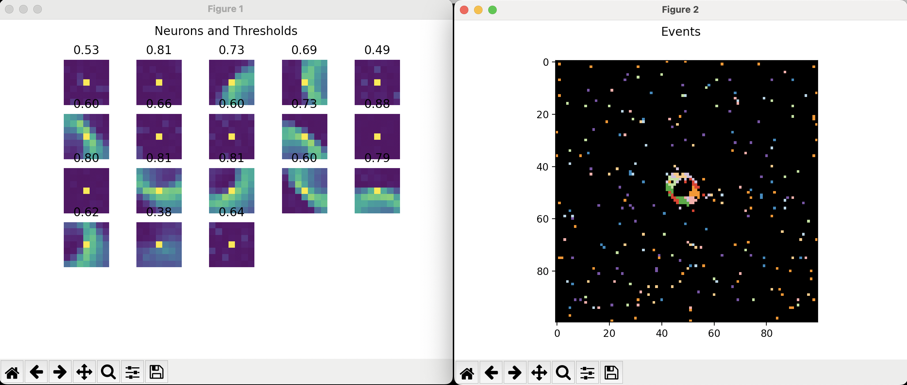

# SimpleFeast.py
 A simple implementation of FEAST on simulated event data




## Citation
```
@article{afshar2020event,
  title={Event-based feature extraction using adaptive selection thresholds},
  author={Afshar, Saeed and Ralph, Nicholas and Xu, Ying and Tapson, Jonathan and Schaik, Andr{\'e} van and Cohen, Gregory},
  journal={Sensors},
  volume={20},
  number={6},
  pages={1600},
  year={2020},
  publisher={Multidisciplinary Digital Publishing Institute}
}
```
**[Event-based feature extraction using adaptive selection thresholds](https://www.mdpi.com/1424-8220/20/6/1600)**  
*Saeed Afshar, Nicholas Ralph, Ying Xu, Jonathan Tapson, André van Schaik, and Gregory Cohen*
